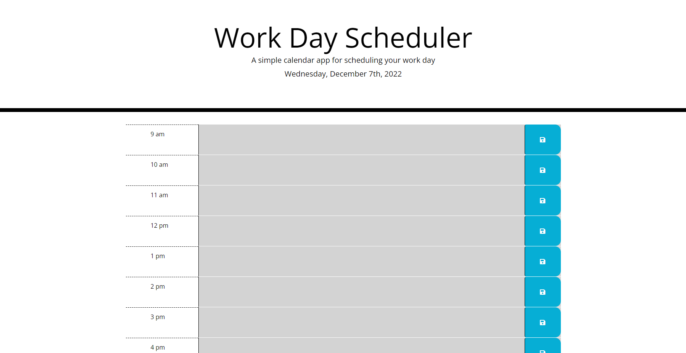

  # Calender Scheduler

  
  ## Description

  This project provides the user with a simple webpage for a user to plan their workday out.
  
---
  ## Table of Contents

  * [Installation](#installation)
  * [Usage](#usage)
  * [License](#license)
  * [Contribution](#contribution)
  * [Tests](#tests)
  * [Questions](#questions)
---
  ## [Installation](#table-of-contents)

  To install the project, proceed to the link that is provided.  This is a webpage application.

---
  ## [Usage](#table-of-contents)

  Usage of this application is done through a web browser, by clicking on the event blocks, typing in your event, and then saving.  If you need to remove an event, you can delete them all at once from the trash can at the bottom.
  

---
  ## [License](#table-of-contents)

  The application is covered under the following license:

  [MIT](https://choosealicense.com/licenses/MIT)

---
  ## [Contribution](#table-of-contents)

  Please use github or email me to contact me about contributing to this project.

---
  ## [Tests](#table-of-contents)

  To test the application, you may clone the project from my github, and install it onto your computer. 

---
  ## [Questions](#table-of-contents)

  Please use the following links for contact:

  [GitHub](https://github.com/areed98)

  [Email: austinjreed89@gmail.com](mailto:austinjreed89@gmail.com)
